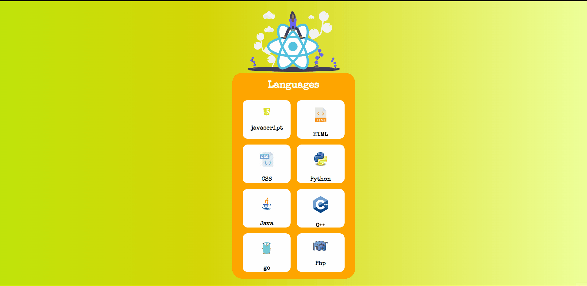

# Language Cards

## In this Project:

### I have used;

- React.js,

- Local State for changing card side,

- CSS,

- map function for monitoring the language data from source of data.js.

## Outcome:

<!-- You can learn more in the [Create React App documentation](https://facebook.github.io/create-react-app/docs/getting-started). -->

